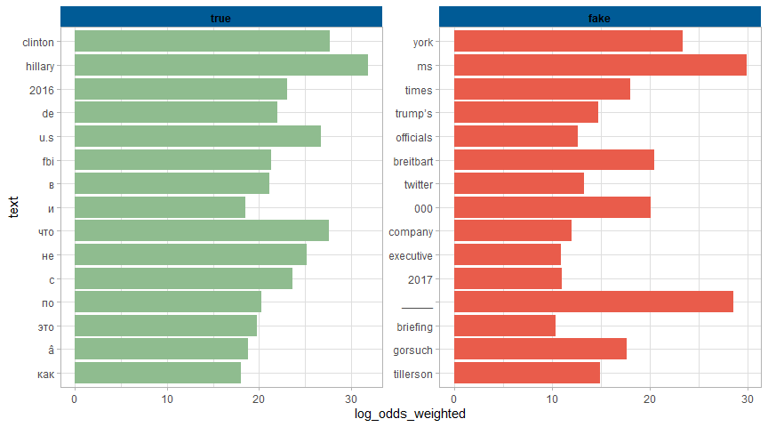
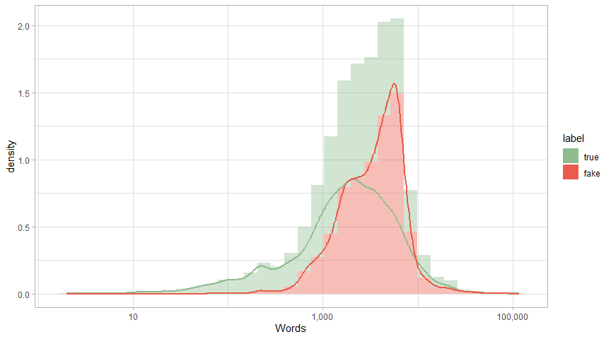
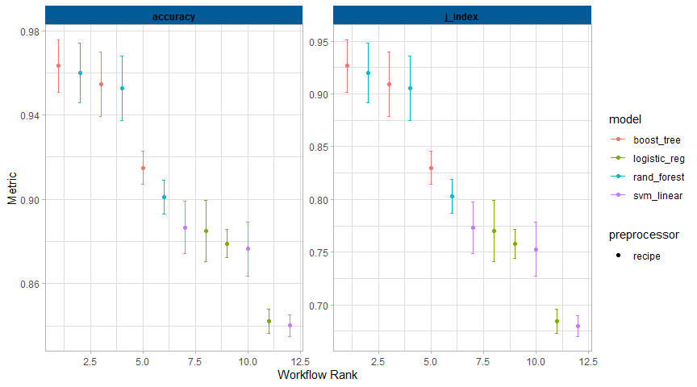

Fake News Detection with R
================

-   [About the project](#about-the-project)
    -   [What is NLP](#what-is-nlp)
-   [Data Loading](#data-loading)
-   [Distribution fake/true news](#distribution-faketrue-news)
-   [Which autor are more associated with fake/true
    news?](#which-autor-are-more-associated-with-faketrue-news)
-   [Which words are more associated with fake/true
    news?](#which-words-are-more-associated-with-faketrue-news)
-   [Are fake news lengthy than the true
    ones?](#are-fake-news-lengthy-than-the-true-ones)
-   [Model creation](#model-creation)
    -   [Data Splitting](#data-splitting)
    -   [Preprocessing the text](#preprocessing-the-text)
    -   [Defining the models](#defining-the-models)
    -   [Model tuning](#model-tuning)
    -   [Define the preprocessor tunable parameters for
        LightGBM](#define-the-preprocessor-tunable-parameters-for-lightgbm)
-   [Choosing the best model](#choosing-the-best-model)

## About the project

### What is NLP

## Data Loading

``` r
library(tidymodels)
library(tidytext)
library(ranger)
library(janitor)
library(bonsai)
library(discrim)
library(textrecipes)
library(here)
library(tidyverse)

theme_set(
  theme_light() + 
    theme(strip.background = element_rect(fill = "#005b96", linewidth = 1),
          strip.text = element_text(face = "bold", hjust = 0.5, colour = "black"))
)

news <- read_csv(paste0(here(), "/Data/train.csv")) # https://www.kaggle.com/competitions/fake-news/data
glimpse(news)
```

    ## Rows: 20,800
    ## Columns: 5
    ## $ id     <dbl> 0, 1, 2, 3, 4, 5, 6, 7, 8, 9, 10, 11, 12, 13, 14, 15, 16, 17, 1~
    ## $ title  <chr> "House Dem Aide: We Didn’t Even See Comey’s Letter Until Jason ~
    ## $ author <chr> "Darrell Lucus", "Daniel J. Flynn", "Consortiumnews.com", "Jess~
    ## $ text   <chr> "House Dem Aide: We Didn’t Even See Comey’s Letter Until Jason ~
    ## $ label  <dbl> 1, 0, 1, 1, 1, 0, 1, 0, 0, 0, 0, 0, 1, 1, 1, 0, 0, 1, 1, 0, 1, ~

``` r
news <- news %>% 
  mutate(content = paste(title, text, sep = " "),
         label = if_else(label == 1, "true", "fake"),
         label = factor(label, levels = c("true","fake"))) %>% # Setting 'true' as event level
  relocate(label, .before = 1) %>% 
  select(-title,-text) 

head(news)
```

    ## # A tibble: 6 x 4
    ##   label    id author             content                                        
    ##   <fct> <dbl> <chr>              <chr>                                          
    ## 1 true      0 Darrell Lucus      "House Dem Aide: We Didn’t Even See Comey’s Le~
    ## 2 fake      1 Daniel J. Flynn    "FLYNN: Hillary Clinton, Big Woman on Campus -~
    ## 3 true      2 Consortiumnews.com "Why the Truth Might Get You Fired Why the Tru~
    ## 4 true      3 Jessica Purkiss    "15 Civilians Killed In Single US Airstrike Ha~
    ## 5 true      4 Howard Portnoy     "Iranian woman jailed for fictional unpublishe~
    ## 6 fake      5 Daniel Nussbaum    "Jackie Mason: Hollywood Would Love Trump if H~

## Distribution fake/true news

``` r
news %>% 
  janitor::tabyl(label)
```

    ##  label     n  percent
    ##   true 10413 0.500625
    ##   fake 10387 0.499375

-   Dataset is balanced.

## Which autor are more associated with fake/true news?

``` r
news %>% 
  #filter(!str_detect(author, "^\\d|-|[:space:]|[:blank:]")) %>% 
  count(label, author, sort = TRUE, name = "count") %>% 
  group_by(label) %>% 
  slice_max(count, n = 10) %>% 
  mutate(author = fct_reorder(author, count),
         author = fct_recode(author, "Alexander Light" = "noreply@blogger.com (Alexander Light)")) %>% 
  filter(!author %in% c("nan", "admin")) %>% 
  ggplot(aes(author, count, fill = label)) +
  geom_col(show.legend = FALSE) +
  facet_wrap(vars(label), scales = "free") +
  scale_fill_manual(values = c("#8FBC8F", "#E95C4B")) +
  coord_flip()
```

<!-- -->

## Which words are more associated with fake/true news?

``` r
## Try different approaches: term-frequency, tf-idf, weighted log-odds (tidylo package)
## Textcat package to deal with other languages (https://www.kaggle.com/code/alyssalbrown/tf-idf-and-xgboost-97-6-score)
## Maybe keep only english words
news_words <- news %>% 
  unnest_tokens(text, content) %>% 
  count(label, text, sort = TRUE)

news_words %>% 
  anti_join(stop_words, 
            by = c("text" = "word")) %>%
  filter(!str_detect(text, "^<U|^http")) %>% # take out other language words and useless information
  tidylo::bind_log_odds(label, text, n) %>% 
  #bind_tf_idf(text, label, n) %>% 
  group_by(label) %>% 
  slice_max(log_odds_weighted, n = 15) %>% 
  mutate(text = fct_reorder(text, n)) %>%
  ungroup() %>% 
  ggplot(aes(text, log_odds_weighted, fill = label)) +
  geom_col(show.legend = FALSE) +
  facet_wrap(vars(label), scales = "free") +
  scale_fill_manual(values = c("#8FBC8F", "#E95C4B")) +
  coord_flip()
```

<!-- -->

## Are fake news lengthy than the true ones?

``` r
news %>% 
  mutate(length = str_count(content, pattern = "[:word:]")) %>% 
  ggplot(aes(length, y=after_stat(density))) +
  geom_histogram(aes(fill = label), alpha = 0.4, bins = 35) +
  geom_density(aes(color = label), linewidth = 1) +
  scale_x_log10(labels = scales::comma) +
  scale_fill_manual(values = c("#8FBC8F", "#E95C4B")) +
  scale_color_manual(values = c("#8FBC8F", "#E95C4B")) +
  labs(x='Words')
```

<!-- -->

``` r
# Might be better to use text features on modelling
```

## Model creation

### Data Splitting

``` r
news_split <- news %>% 
  select(-author) %>% 
  slice_sample(prop = 0.15) %>% 
  initial_split(prop = 0.75, strata = label)

news_train <- training(news_split)
news_test <- testing(news_split)

news_folds <- vfold_cv(news_train, v = 3, strata = label)
```

### Preprocessing the text

``` r
tfidf_rec <- recipe(label ~ content, data = news_train) %>% 
  step_tokenize(content) %>% 
  step_stopwords(content) %>%
  step_tokenfilter(content, max_tokens = 180) %>% 
  step_tfidf(content) %>% 
  step_normalize(all_numeric_predictors())

stem_rec <- recipe(label ~ content, data = news_train) %>% 
  step_tokenize(content) %>% 
  step_stopwords(content) %>%
  step_stem(content) %>% 
  step_tokenfilter(content, max_tokens = 180) %>% 
  step_tfidf(content) %>% 
  step_normalize(all_numeric_predictors())

text_features_rec <- recipe(label ~ content, data = news_train) %>%
  step_textfeature(content, keep_original_cols = TRUE) %>% 
  step_zv(all_numeric_predictors()) %>% 
  step_corr(all_numeric_predictors(), method = "spearman") %>% 
  step_tokenize(content) %>% 
  step_stopwords(content) %>%
  step_tokenfilter(content, max_tokens = 180) %>% 
  step_tfidf(content) %>% 
  step_normalize(all_numeric_predictors()) 


## Try different approaches like texthashing (seems to take long time to process),
## higher ngrams (step_ngram = no difference in accuracy)
## custom stopwords(?)
```

### Defining the models

``` r
rf_spec <- rand_forest() %>% 
  set_engine("ranger") %>% 
  set_mode("classification")

glm_spec <- logistic_reg() %>% 
  set_engine("glm") %>% 
  set_mode("classification")

svm_spec <- svm_linear() %>% 
  set_engine("LiblineaR") %>% 
  set_mode("classification")

lgbm_spec <- boost_tree() %>% 
  set_engine("lightgbm") %>% 
  set_mode("classification")
```

### Model tuning

``` r
tictoc::tic()
model_rs <- workflowsets::workflow_set(preproc = list(tfidf = tfidf_rec, 
                                                      stem = stem_rec, 
                                                      text_features = text_features_rec),
                                       models = list(rf = rf_spec,
                                                     glm = glm_spec,
                                                     svm = svm_spec,
                                                     lgbm = lgbm_spec), 
                                       cross = TRUE) %>% 
  workflow_map("fit_resamples", 
               resamples = news_folds, 
               verbose = TRUE,
               seed = 125,
               metrics = metric_set(accuracy, j_index), 
               control = control_grid(save_pred = TRUE))
tictoc::toc()
```

    ## 1775.36 sec elapsed

``` r
write_rds(model_rs, file = here("Data/all_models_rs.rds"))

autoplot(model_rs)
```

<!-- -->

### Define the preprocessor tunable parameters for LightGBM

``` r
lgbm_wf <-
  recipe(label ~ content, data = news_train) %>%
  step_textfeature(content, keep_original_cols = TRUE) %>% 
  step_zv(all_numeric_predictors()) %>% 
  step_corr(all_numeric_predictors(), method = "spearman") %>% 
  step_tokenize(content) %>% 
  step_stopwords(content) %>%
  step_tokenfilter(content, max_tokens = tune()) %>% 
  step_ngram(num_tokens = tune()) %>% 
  step_tfidf(content) %>% 
  step_normalize(all_numeric_predictors()) %>%  
  workflow(spec = lgbm_spec)
```

``` r
lgbm_grid <- grid_latin_hypercube(max_tokens(c(100,300)),
                                  num_tokens(c(1,3)),
                                  size = 10)

tictoc::tic()
lgbm_rs <- tune_grid(lgbm_wf,
                     resamples = news_folds,
                     grid = lgbm_grid,
                     metrics = metric_set(accuracy, j_index),
                     control = control_grid(verbose = TRUE, save_pred = TRUE))
tictoc::toc()
```

    ## 1885.31 sec elapsed

``` r
write_rds(lgbm_rs, file = here("Data/lgbm_rs.rds"))

autoplot(lgbm_rs)
```

<!-- -->
We can see that: \* The more words retained in the training set, the
better the results  
\* Setting higher ngrams (2 or 3) doesn’t seem to make a difference

## Choosing the best model

``` r
lgbm_fit <- model_rs %>%
  extract_workflow("text_features_lgbm") %>% 
  last_fit(news_split,
           metrics = metric_set(accuracy, j_index))

lgbm_fit
```

    ## # Resampling results
    ## # Manual resampling 
    ## # A tibble: 1 x 6
    ##   splits             id               .metrics .notes   .predictions .workflow 
    ##   <list>             <chr>            <list>   <list>   <list>       <list>    
    ## 1 <split [2339/781]> train/test split <tibble> <tibble> <tibble>     <workflow>
