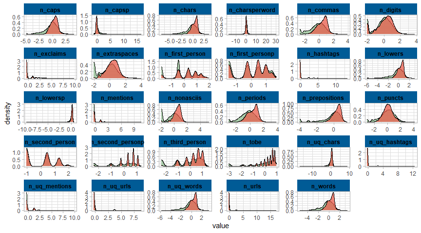

Fake News Detection with R
================

-   [About the project](#about-the-project)
    -   [What is NLP](#what-is-nlp)
-   [Data Loading](#data-loading)
-   [Distribution fake/true news](#distribution-faketrue-news)
-   [Which autor are more associated with fake/true
    news?](#which-autor-are-more-associated-with-faketrue-news)
-   [Which words are more associated with fake/true
    news?](#which-words-are-more-associated-with-faketrue-news)
-   [Are fake news lengthy than the true
    ones?](#are-fake-news-lengthy-than-the-true-ones)
-   [Model creation](#model-creation)
    -   [Data Splitting](#data-splitting)
    -   [Preprocessing the text](#preprocessing-the-text)
    -   [Defining the models](#defining-the-models)

## About the project

### What is NLP

## Data Loading

``` r
library(tidymodels)
library(tidytext)
library(ranger)
library(textrecipes)
library(here)
library(tidyverse)

news <- read_csv(paste0(here(), "/Data/train.csv"))
glimpse(news)
```

    ## Rows: 20,800
    ## Columns: 5
    ## $ id     <dbl> 0, 1, 2, 3, 4, 5, 6, 7, 8, 9, 10, 11, 12, 13, 14, 15, 16, 17, 1~
    ## $ title  <chr> "House Dem Aide: We Didn’t Even See Comey’s Letter Until Jason ~
    ## $ author <chr> "Darrell Lucus", "Daniel J. Flynn", "Consortiumnews.com", "Jess~
    ## $ text   <chr> "House Dem Aide: We Didn’t Even See Comey’s Letter Until Jason ~
    ## $ label  <dbl> 1, 0, 1, 1, 1, 0, 1, 0, 0, 0, 0, 0, 1, 1, 1, 0, 0, 1, 1, 0, 1, ~

``` r
news <- news %>% 
  mutate(content = paste(title, text, sep = " "),
         label = if_else(label == 1, "true", "fake"),
         label = factor(label, levels = c("true","fake"))) %>% # Setting 'true' as event level
  relocate(label, .before = 1) %>% 
  select(-title,-text) 
news
```

    ## # A tibble: 20,800 x 4
    ##    label    id author                       content                             
    ##    <fct> <dbl> <chr>                        <chr>                               
    ##  1 true      0 Darrell Lucus                "House Dem Aide: We Didn’t Even See~
    ##  2 fake      1 Daniel J. Flynn              "FLYNN: Hillary Clinton, Big Woman ~
    ##  3 true      2 Consortiumnews.com           "Why the Truth Might Get You Fired ~
    ##  4 true      3 Jessica Purkiss              "15 Civilians Killed In Single US A~
    ##  5 true      4 Howard Portnoy               "Iranian woman jailed for fictional~
    ##  6 fake      5 Daniel Nussbaum              "Jackie Mason: Hollywood Would Love~
    ##  7 true      6 nan                          "Life: Life Of Luxury: Elton John’s~
    ##  8 fake      7 Alissa J. Rubin              "Benoît Hamon Wins French Socialist~
    ##  9 fake      8 nan                          "Excerpts From a Draft Script for D~
    ## 10 fake      9 Megan Twohey and Scott Shane "A Back-Channel Plan for Ukraine an~
    ## # ... with 20,790 more rows

## Distribution fake/true news

``` r
news %>% count(label)
```

    ## # A tibble: 2 x 2
    ##   label     n
    ##   <fct> <int>
    ## 1 true  10413
    ## 2 fake  10387

-   Dataset seems quite balanced

## Which autor are more associated with fake/true news?

``` r
news %>% 
  #filter(!str_detect(author, "^\\d|-|[:space:]|[:blank:]")) %>% 
  count(label, author, sort = TRUE, name = "count") %>% 
  group_by(label) %>% 
  slice_max(count, n = 10) %>% 
  mutate(author = fct_reorder(author, count),
         author = fct_recode(author, "Alexander Light" = "noreply@blogger.com (Alexander Light)")) %>% 
  filter(author != "nan") %>% 
  ggplot(aes(author, count, fill = label)) +
  geom_col(show.legend = FALSE) +
  facet_wrap(vars(label), scales = "free") +
  scale_fill_manual(values = c("#8FBC8F", "#E95C4B")) +
  coord_flip()
```

<!-- -->

## Which words are more associated with fake/true news?

``` r
## Try different approaches: term-frequency, tf-idf, weighted log-odds (tidylo package)
news_words <- news %>% 
  unnest_tokens(text, content) %>% 
  count(label, text, sort = TRUE)

news_words %>% 
  anti_join(stop_words, 
            by = c("text" = "word")) %>%
  filter(!str_detect(text, "^<U|^http")) %>% # take out other language words and useless information
  bind_tf_idf(text, label, n) %>% 
  group_by(label) %>% 
  slice_max(tf_idf, n = 12) %>% 
  mutate(text = fct_reorder(text, n)) %>%
  ungroup() %>% 
  ggplot(aes(text, tf_idf, fill = label)) +
  geom_col(show.legend = FALSE) +
  facet_wrap(vars(label), scales = "free") +
  scale_fill_manual(values = c("#8FBC8F", "#E95C4B")) +
  coord_flip()
```

<!-- -->

## Are fake news lengthy than the true ones?

``` r
news %>% 
  mutate(length = str_count(content, pattern = boundary(type = "word"))) %>% 
  ggplot(aes(length, y=..density..)) +
  geom_histogram(aes(fill = label), alpha = 0.25) +
  geom_density(aes(color = label)) +
  scale_x_log10() +
  scale_fill_manual(values = c("#8FBC8F", "#E95C4B")) +
  scale_color_manual(values = c("#8FBC8F", "#E95C4B")) +
  labs(x='Words')
```

<!-- -->

## Model creation

### Data Splitting

``` r
news_split <- news %>% 
  select(-author) %>% 
  initial_split(prop = 0.75, strata = label)

news_train <- training(news_split)
news_test <- testing(news_split)

news_folds <- vfold_cv(news_train, v = 5, strata = label)
```

### Preprocessing the text

``` r
tfidf_rec <- recipe(label ~ content, data = news_train) %>% 
  step_tokenize(content) %>% 
  step_stopwords(content) %>% 
  step_tokenfilter(content, max_tokens = tune()) %>% 
  step_tfidf(content)
```

### Defining the models
